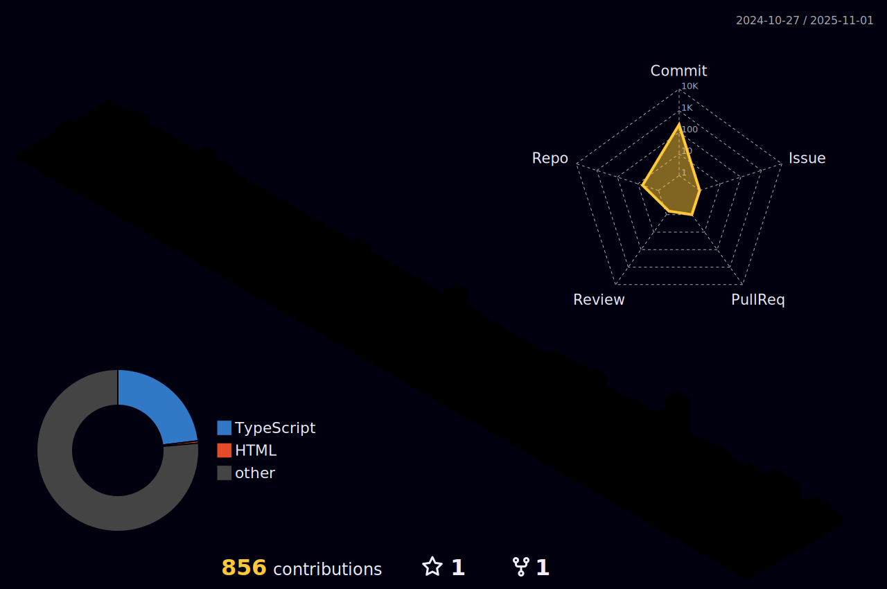

```ts
const H0Y4 = {
  name: "rlaxogh",
  age: 17,
  school: "Gyeongbuk Software Meister High School",
  interests: ["Front-end", "Back-end", "React", "Spring Boot", "Design", "AI", "Real-time apps"],
  goal: "Become a skilled developer and get employed 👨‍💻",
  skills: {
    languages: ["HTML", "CSS", "JavaScript", "TypeScript", "Java", "Python", "C", "Styled-components"],
    frameworks: ["React", "Next.js", "Spring Boot", "Django"],
    tools: ["VS Code", "IntelliJ", "Figma", "Git", "Vercel"]
  },
  motto: "More passionate than yesterday 🌱"
};
```


## Language & Skills I've Learned and Am Currently Studying
<div align="center">
  
    
    
</div>


### 𝐂𝐎𝐍𝐓𝐀𝐂𝐓 𝐌𝐄 𝐖𝐈𝐓𝐇
|  |  |  |  |
|--|--|--|--|
| [](https://discordapp.com/users/867071958071771157) | [](mailto:btm.email2769@gmail.com) | [](https://www.linkedin.com/in/%EA%B9%80%ED%83%9C%ED%98%B8-%EA%B9%80%ED%83%9C%ED%98%B8-099213361/) | [](https://www.instagram.com/btm.email2769/)



